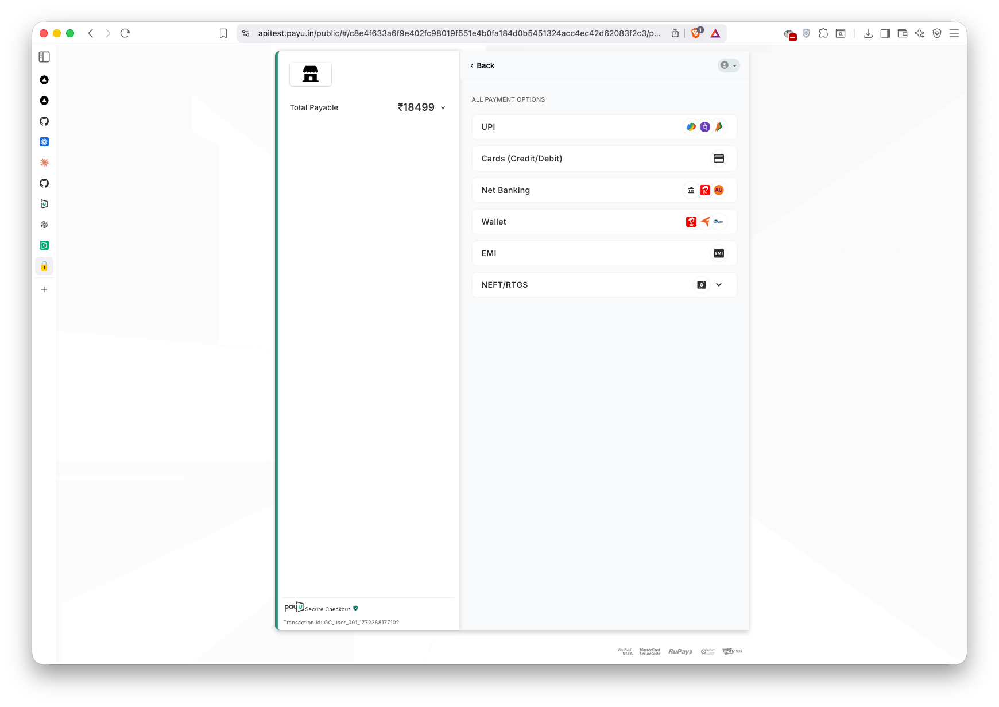

# GrabCredit — AI-Powered BNPL at Checkout

**Live demo → [https://grabcredit-bnpl.vercel.app](https://grabcredit-bnpl.vercel.app)**

**Loom walkthrough:**
- [Part 1 — Business & Product Demo](https://www.loom.com/share/5b65211576e24302a653b4ea78705578) (5 min)
- [Part 2 — Technical Architecture](https://www.loom.com/share/4e4d831e3b4f41c5a8a0b6ad578f3b9d) (5 min)

*Built for the GrabOn Vibe Coder Challenge — Project 01. GrabCredit leverages GrabOn's 96M+ annual transactions and its partnerships with Poonawalla Fincorp (NBFC lending license) and PayU LazyPay to enable embedded BNPL at checkout.*

GrabOn processes millions of coupon redemptions and deal transactions every year. Most Indians don't have a CIBIL score or a credit card — so traditional lenders can't serve them. But their shopping behavior tells a complete story: how regularly they buy, whether their spending is growing, how they pay, what categories they shop. **GrabCredit reads that story and turns it into an instant Buy Now, Pay Later decision at checkout.**

No credit bureau pull. No income verification. No paperwork. A shopper adds headphones to cart, clicks "Pay with GrabCredit," and in seconds sees a personalised EMI offer — plus an AI-written explanation of exactly why they qualify, or what they need to improve to get there.


---

## How It Works

```
┌─────────────────────────────────────────────────────┐
│                    WHO USES IT                       │
│                                                      │
│   Shopper (Browser)        Claude Desktop            │
│         │                        │                   │
│         ▼                        │ stdio             │
│   Next.js Web App                │                   │
│   (Checkout Widget)              │                   │
│         │ API routes             │                   │
│         └──────────┬─────────────┘                   │
│                    ▼                                  │
│           ┌─────────────────┐                        │
│           │   MCP Server    │                        │
│           │  (8 tools)      │                        │
│           └────────┬────────┘                        │
│        ┌───────────┼───────────┐                     │
│        ▼           ▼           ▼                     │
│   Scoring      Fraud       PayU                      │
│   Engine       Detection   LazyPay                   │
│   (5 factors)  (6 flags)   mock / live               │
│        │                       │                     │
│        ▼                       ▼                     │
│  users.json            PayU Sandbox API              │
│  transactions.json     (PAYU_MODE=live)              │
│        │                                             │
│        ▼                                             │
│   Claude Narrative ──► Anthropic API                 │
│   Generator            (claude-sonnet)               │
└─────────────────────────────────────────────────────┘
```


**Four things working together:**

1. **The MCP Server** is the brain. It's a Node.js server that exposes all the credit logic as tools — get a user's profile, calculate their score, check for fraud, generate EMI options. It can plug directly into Claude Desktop so you can ask questions like *"What's Priya's credit profile?"* and get live answers.

2. **The checkout widget** (Next.js web app) is what a merchant partner would embed at checkout. It calls the MCP server's tools directly and shows the result — an EMI offer, a rejection with an improvement path, or a fraud block.

3. **The scoring engine** reads GrabOn transaction data and produces a 0–1000 score from 5 behavioral factors. No black box — every factor is explainable and every decision has a reason.

4. **PayU LazyPay** handles the EMI disbursal. The integration has two modes: mock (works on first clone, no credentials) and live sandbox (real PayU API calls, real transaction IDs). Both paths are production-ready — the mock exists so evaluators don't need to set up credentials to see the full UI flow.

---

## How to Run Locally

### Prerequisites
- **Node.js** ≥ 18
- **Anthropic API key** — for Claude-powered narratives ([get one here](https://console.anthropic.com/settings/keys))

### Quick start (one command)

```bash
git clone https://github.com/aayushnamdev/grabcredit-bnpl.git
cd grabcredit-bnpl

# Set your API key
cp .env.example web-app/.env.local
# Edit web-app/.env.local and add your ANTHROPIC_API_KEY

# Install, build, and launch
./scripts/demo.sh
```

Open [http://localhost:3000](http://localhost:3000). Switch personas at the top of the page.

### Manual setup (step-by-step)

```bash
# Step 1: Build the MCP server
cd mcp-server
npm install
npm run build       # compiles TypeScript → dist/, copies src/data/*.json → dist/data/

# Step 2: Configure env vars
cd ../web-app
cp ../.env.example .env.local
# Edit .env.local — paste your ANTHROPIC_API_KEY

# Step 3: Start the web app
npm install
npm run dev
```

### Run the test suite

```bash
cd mcp-server
npm test
```

21 unit tests covering: all 5 persona tiers, credit limit interpolation, the confidence dampener (zero-transaction edge case), fraud flag boundaries (6/7/8-day account age rule, single-pattern combo), and factor weight integrity.

### Environment Variables

| Variable | Required | Default | Description |
|----------|----------|---------|-------------|
| `ANTHROPIC_API_KEY` | Yes (for narratives) | — | Claude API key for generating credit narratives |
| `PAYU_MODE` | No | `mock` | `mock` for simulated PayU responses, `live` for sandbox API |
| `PAYU_KEY` | Only if live | — | PayU sandbox merchant key |
| `PAYU_SALT` | Only if live | — | PayU sandbox merchant salt |

---

## The 5 Personas

Each persona is a carefully designed behavioral archetype that tells a story during the demo:

| # | Name | Archetype | Score | Tier | What They Demonstrate |
|---|------|-----------|-------|------|----------------------|
| 1 | **Priya Sharma** | Power User | 927 | Pre-Approved | 200+ transactions across 5 categories, 18-month history, growing GMV, 1.8% returns. The dream customer — pre-approved with ₹92K limit and 0% EMI. |
| 2 | **Rahul Verma** | Steady Spender | 672 | Approved | 80 transactions, mostly Food + Fashion, flat but consistent GMV, 5% returns. Solid but not exceptional — approved at 14% APR with ₹25K limit. |
| 3 | **Ananya Iyer** | New But Promising | 489 | Conditional | 25 transactions in 3 months, strong upward trajectory but single category (Travel), 0% returns. Great potential, limited history — conditional at 20% APR with ₹8K limit. Shows the "almost there" messaging. |
| 4 | **Vikram Singh** | Declining User | 312 | Rejected | 60 transactions but GMV declining 40% over 6 months, rising returns (11%), narrowing categories. The empathetic rejection — "we see you're pulling back, and we respect that." Shows the improvement path UI. |
| 5 | **Ghost User** | Suspicious New | 0 | Fraud-Rejected | 3 days old, 2 high-value electronics transactions, COD only, zero coupons. Triggers 3 fraud flags simultaneously. Shows the security-conscious rejection without revealing detection logic. |

---

## How the Credit Score Works

The scoring engine produces a 0–1000 score from five behavioral factors. Each factor was chosen because it maps to a measurable behavioral signal that traditional credit bureaus miss entirely.

### Factor 1: Purchase Consistency (25%)

**The insight:** Consistent monthly spending is the strongest proxy for financial stability. Someone who shops ₹3,000/month for 12 months straight is more creditworthy than someone who spends ₹36,000 in a single burst — even though the total is identical.

**How it works:**
- **Active months ratio** (40%): What fraction of months since registration had at least one transaction? A ratio of 0.9 means near-continuous engagement.
- **Coefficient of variation** (40%): How volatile is monthly spend? A CV below 0.3 means predictable behavior. High CV (erratic spending) gets penalized.
- **Recency** (20%): Exponential decay based on days since last transaction. A user who hasn't transacted in 60 days scores near zero on this sub-factor.

**Psychology framing:** This measures *conscientiousness* — the personality trait most predictive of financial reliability in behavioral economics literature.

### Factor 2: Deal Engagement Quality (20%)

**The insight:** On a deals platform, coupon usage isn't just about saving money — it reveals financial intentionality. But there's a sweet spot.

**How it works:**
- **Coupon redemption rate** (40%): A bell curve scoring model — 40–60% redemption is the sweet spot (financially smart), while >80% suggests extreme price sensitivity (higher default risk), and <20% suggests disengagement from the platform's core value.
- **Category diversification** (40%): Users who shop across both essential (Food, Health) and discretionary (Fashion, Travel, Electronics) categories score highest. Single-category users score 35/100. The engine also detects **category narrowing** — if a user historically shopped 4+ categories but recent transactions concentrate in 1–2, the score drops.
- **Merchant loyalty** (20%): Repeat purchases at the same merchants signal stable preferences, not impulsive browsing.

**Psychology framing:** This measures *revealed preference breadth* — diverse, intentional deal usage correlates with stable financial planning.

### Factor 3: Financial Trajectory (20%)

**The insight:** Direction matters more than position. A user trending upward at ₹2,000/month is a better credit bet than a user declining from ₹10,000/month — even if the second user has higher total spend.

**How it works:**
- Linear regression on the non-zero months of the 12-month GMV trend
- Normalized slope (slope / mean): `>0.03` = growth (score 85), `-0.02 to +0.03` with low CV = stable (score 100), `< -0.02` = declining (exponential penalty)
- An additional **decline modifier** at the engine level: if the normalized slope is below -0.03, the entire final score is multiplied by a penalty factor (down to 0.5×)

**Why stable > growing:** A user spending ₹8,000/month consistently for a year with low variance is demonstrating the kind of predictability lenders love. Growth is good, but stability is better — it's a feature, not a coincidence.

### Factor 4: Risk Signals (20%)

**The insight:** Returns and payment methods are behavioral risk indicators that traditional scoring completely ignores.

**How it works:**
- **Category-adjusted return rate** (40%): A 15% return rate in Fashion is normal (industry: 20%). The same rate in Food is alarming (industry: 3%). The engine benchmarks per-category rather than using a blanket threshold.
- **Payment mode risk** (40%): Credit card (100) > UPI (90) > Debit Card (85) > NetBanking (70) > COD (30). A user who pays primarily via COD on a digital platform signals they don't trust or don't have access to digital payment — a real risk indicator for BNPL.
- **High-value concentration** (20%): If two transactions account for >50% of total GMV, that's a red flag — it suggests lumpy, potentially impulsive purchasing rather than regular commerce.

### Factor 5: Account Maturity (15%)

**The insight:** Account age alone is a weak signal. Account age *combined with activity density* is a strong one.

**How it works:**
- **Bracket scoring** (50%): ≥50 transactions + ≥6 active months = 100. Below 15 transactions = automatic 5/100 (insufficient data).
- **Transaction count** (30%): Log-scale (diminishing returns — the 200th transaction adds less signal than the 20th).
- **Active ratio** (20%): Active months / total months since registration.

### Confidence Dampener

Users with sparse data shouldn't get extreme scores. The engine applies a confidence factor based on `sqrt(min(txns, 200)/200) × sqrt(min(activeMonths, 12)/12)`. This pulls scores toward 50 (neutral) for users with limited history, preventing both false approvals and unfair rejections.

### Fraud Detection (Binary Override)

Before scoring even begins, the fraud engine runs five checks:

| Flag | Trigger | Action |
|------|---------|--------|
| New Account | Account < 7 days old | Auto-reject |
| Velocity Spike | > ₹20,000 spent in first 48 hours | Review |
| Category Jump | > 80% GMV in one category + high-value outlier in another | Review |
| Single-Pattern Combo | < 30 days + single payment mode + single category + 0% coupons | Auto-reject |
| Electronics Concentration | > 80% GMV in Electronics with < 10 total transactions | Monitor |
| Dormant Account | Account > 90 days old with 0 total transactions | Review |

If any flag triggers `auto-reject`, the scoring engine is skipped entirely — the user gets a fraud-rejected tier with score 0.

### Score → Decision Mapping

| Score | Tier | Credit Limit | Rate | EMI Tenures |
|-------|------|-------------|------|-------------|
| 800–1000 | Pre-Approved | ₹50K–₹1L (interpolated) | 0% + ₹299 flat fee | 3, 6, 9, 12 months |
| 600–799 | Approved | ₹15K–₹50K (interpolated) | 14% APR | 3, 6, 9 months |
| 400–599 | Conditional | ₹5K–₹15K (interpolated) | 20% APR | 3, 6 months |
| < 400 | Rejected | — | — | — |
| Fraud-flagged | Fraud-Rejected | — | — | — |

Credit limits are linearly interpolated within each tier band — a score of 700 gets a higher limit than 620.

---

## What the AI Can Do (MCP Tools)

The server follows the MCP specification with stdio transport and newline-delimited JSON (NDJSON) framing.

**8 Tools:**

| Tool | Input | Description |
|------|-------|-------------|
| `get_user_profile` | `user_id` | Returns full aggregated user profile |
| `get_transaction_history` | `user_id`, `months?` | Returns raw transactions (default 12 months) |
| `get_credit_score` | `user_id` | Full scoring with all 5 factors, fraud flags, tier, and limit |
| `get_emi_options` | `user_id`, `purchase_amount` | Original EMI calculator (18/24/30% by tier) |
| `get_payu_emi_options` | `user_id`, `purchase_amount`, `merchant_name?` | PayU LazyPay EMI options (0%+₹299 / 14% / 20%) |
| `confirm_emi_plan` | `user_id`, `purchase_amount`, `selected_months`, `merchant_name?` | Creates EMI plan via PayU (mock/live), returns schedule |
| `check_fraud_velocity` | `user_id` | Returns fraud flags with action severity |
| `generate_credit_narrative` | `user_id` | Calls Claude API to generate personalized narrative |

**2 Resources:**

| Resource | URI | Description |
|----------|-----|-------------|
| Transaction Schema | `transaction://schema` | JSON Schema for the transaction data model |
| Merchant Catalog | `merchant://catalog` | All merchants grouped by category |

**4 Prompts** (pre-built templates for Claude Desktop — `prompts/list` + `prompts/get`):

| Prompt | Arguments | What it does |
|--------|-----------|--------------|
| `full_credit_assessment` | `user_id`, `purchase_amount?` | Chains all tools: profile → fraud → score → narrative → EMI options |
| `compare_risk_profiles` | `user_id_a`, `user_id_b` | Side-by-side credit risk comparison with verdict |
| `improvement_roadmap` | `user_id` | Specific, numbered steps to reach the next credit tier |
| `fraud_deep_dive` | `user_id` | Flag-by-flag fraud analysis with recommended action |

In Claude Desktop you can say: *"Run a full credit assessment for user_003"* and Claude will chain all the right tools automatically.

---

## Why We Built It This Way

### Why TypeScript for everything?

The MCP SDK is TypeScript-first. The scoring engine lives inside the MCP server. The web app is Next.js (TypeScript). One language across the entire stack means no serialization boundaries, shared type definitions, and a single developer's mental model. The web app imports MCP tool functions directly — no socket communication overhead.

### Why these specific scoring weights?

Purchase Consistency gets the highest weight (25%) because in behavioral economics, frequency and regularity of spending is the strongest predictor of financial stability — more so than total amount. Account Maturity gets the lowest (15%) because it's partially redundant with Consistency — a mature account with no consistency is worthless.

### PayU integration — mock default, live sandbox proven

The demo works on first clone with no credentials (mock mode). Set `PAYU_MODE=live` with your PayU sandbox key and salt to exercise the real path: the live client computes a SHA-512 signed payment session and redirects the browser to `test.payu.in` for checkout. PayU validates the hash, issues a real transaction ID, and redirects back to `/payment/callback`.



The mock client generates structurally identical responses (transaction IDs, EMI schedules, timestamps, `mode: "mock"` flag) so the full checkout UI works without credentials.

### Why Next.js API routes instead of a separate Express server?

The web app needs server-side code to call MCP tools (they load JSON files from disk). Next.js API routes give us server-side execution without a separate process. The `eval('require')` pattern prevents Turbopack from bundling the MCP server — a necessary workaround for Turbopack's static analysis of dynamic imports, with a clean fallback via `webpack.config.externals` in production.

### Why Claude Sonnet 4 for narratives, not a template engine?

Templates would be faster but they'd feel generic. The prompt feeds Claude the raw scoring factors, platform averages, and specific user data — Claude then generates narratives that cite exact numbers, compare against benchmarks, and adapt tone by tier. A pre-approved user gets celebratory language; a rejected user gets empathetic, actionable advice. No template can do that without becoming a sprawling if/else tree.

---

## Edge Cases & Error Handling

The scoring engine handles several non-obvious edge cases:

- **Zero transactions**: Users with 0 transactions get `score: 0, tier: rejected` immediately — they never reach the dampener, which would otherwise pull them toward a middling score and a false "conditional" approval.
- **Sparse data (< 3 transactions)**: A minimum-transactions guard (`MINIMUM_TRANSACTIONS_FOR_SCORING = 3`) rejects users with insufficient data before scoring begins.
- **Confidence dampener**: For users with limited history, the engine applies `sqrt(min(txns, 200)/200) * sqrt(min(activeMonths, 12)/12)` to pull scores toward neutral. This prevents both false approvals (thin-file users getting high scores) and unfair rejections (new users being penalized too harshly).
- **Dormant accounts**: Accounts > 90 days old with 0 transactions trigger a `[REVIEW]` fraud flag — distinct from "new account" fraud, this catches abandoned-then-reactivated accounts.
- **7-day boundary precision**: The new-account fraud rule uses `< 7 days` (not `<= 7`), so an account exactly 7 days old passes. Tested with boundary cases at 6, 7, and 8 days.
- **Category-adjusted returns**: A 15% return rate in Fashion (industry norm: 20%) is fine; the same rate in Food (norm: 3%) is a red flag. Returns are benchmarked per-category, not globally.

---

## What I'd Build With More Time

Listed by implementation priority — what would move the needle most for production readiness:

1. **Real CIBIL integration as a validation layer** *(P0 — regulatory necessity)*: Use the behavioral score as a fast pre-screen, then pull CIBIL for final underwriting on approved users. Compare behavioral vs. bureau scores over time to calibrate the model.

2. **Real-time fraud velocity on transaction stream** *(P0 — risk)*: The current fraud check runs at scoring time on historical data. In production, you'd want a streaming check that flags suspicious patterns as transactions happen, not after the fact.

3. **Cohort-based scoring** *(P1 — model accuracy)*: Cluster users by behavior similarity (k-means on the 5 factor scores), then use cohort default rates to calibrate individual scores. A user who looks like other users who defaulted should get a stricter assessment, regardless of their individual metrics.

4. **Temporal risk scoring** *(P1 — model accuracy)*: Weight recent transactions more heavily using exponential decay. A user who was great for 11 months but had a terrible last month should score differently than a consistently mediocre user — the model currently doesn't capture this nuance beyond the decline modifier.

5. **Merchant-side analytics dashboard** *(P2 — growth)*: Show merchants their BNPL conversion rates segmented by user tier. "12% of your checkout users are pre-approved but only 4% chose EMI — here's how to surface the offer earlier."

6. **A/B testing framework for EMI presentation** *(P2 — optimization)*: Test whether showing total cost vs. monthly amount first affects conversion. Test whether showing the AI narrative upfront vs. behind a "Why?" click matters.

---

## Data Structure

Full field-level schema for Transaction and User Profile types: **[docs/data-schema.md](docs/data-schema.md)**

Data lives in `mcp-server/src/data/`. TypeScript interfaces in `mcp-server/src/types.ts`.
